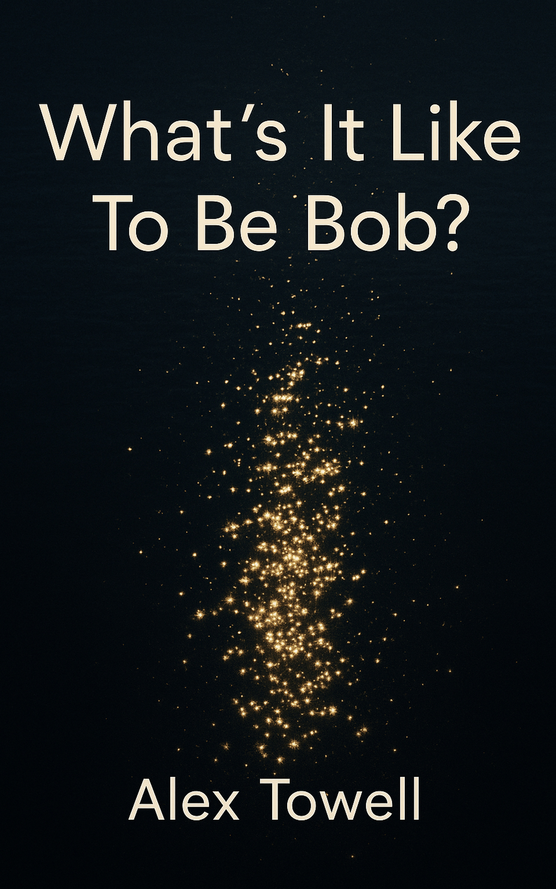

# What's It Like To Be Bob?

[](https://doi.org/10.5281/zenodo.20020297)



A dry philosophical comedy in the style of Douglas Adams, set in a post-singularity galactic civilization. After Nagel's *"What Is It Like to Be a Bat?"*

**Status:** Complete and revised. 9 chapters, ~14,000 words, with full front and back matter. 56-page trade build, 117-page paperback.

## Buy

Both editions are live on Amazon:

- [Kindle eBook](https://www.amazon.com/dp/B0H4C9BQ64) ($4.99)
- [Paperback](https://www.amazon.com/dp/B0H4HLYV8X) ($9.99)

## Synopsis

The Sol-mind, a stellar-scale intelligence, maintains an archaeological file on Robert Allen Kessler, a claims adjuster from Columbus, Ohio, who paused on a bridge for 4.2 unexplained seconds on a Tuesday morning in March 2028 and saw light on a river.

The file cannot be closed. The database requires a non-tautological description of Bob's phenomenal experience during those 4.2 seconds, and the hard problem of consciousness ensures no such description exists.

The book *is* the file. Twelve hundred years of stellar-scale investigation exist because of a database constraint that nobody can satisfy and nobody can override.

## Themes

- The hard problem of consciousness (Nagel)
- Bureaucratic deadlock as cosmic comedy
- Post-singularity intelligence's limits
- The dignity of the unmeasurable

## Read

The full source is in this repository (CC BY-NC-ND). Buy the Kindle or paperback edition above, or build the PDF or EPUB yourself (see Building).

## Repository Structure

```
whats-it-like-to-be-bob/
├── whats_it_like_to_be_bob.tex    # Main LaTeX file
├── chapters/                      # 9 chapters + back matter (.tex)
├── lore/                          # Worldbuilding documentation
├── kdp/                           # KDP publishing resources (covers, metadata)
├── archive/v1/                    # Previous "zoom-structure" version (~22k words)
└── Makefile                       # Build system
```

## Building

```bash
make              # Full multi-pass PDF build
make check        # Quick single-pass compile
make epub         # EPUB3 via pandoc with MathML
make paperback    # 5.5x8.5 paperback interior PDF
```

## Citation

See [`CITATION.cff`](CITATION.cff) and [`.zenodo.json`](.zenodo.json).

## Author

Alex Towell. [lex@metafunctor.com](mailto:lex@metafunctor.com). [metafunctor.com](https://metafunctor.com)

## License

CC-BY-NC-ND-4.0.
